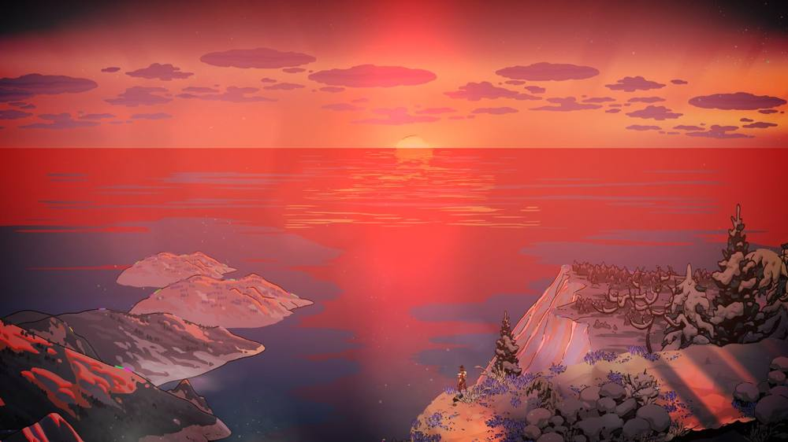
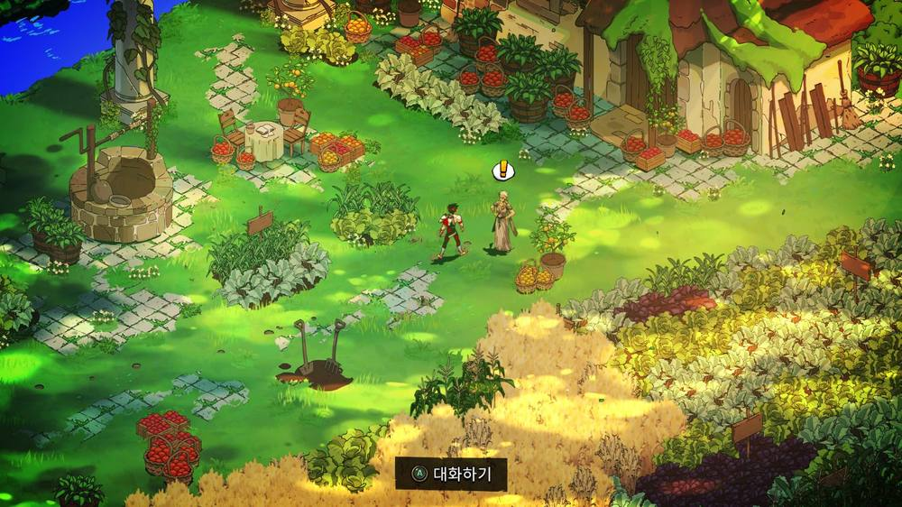

드디어!!
너무 어려웠는데 어떻게든 해냈습니다.

켄타우로스의 심장을 많이 선택한 점, 엘리시움에서 부활 횟수를 소모하지 않고 최종전까지 돌입한 덕분에 유리하게 게임을 이끌어나갈 수 있었던 것 같네요.

늘 어두컴컴하고 칙칙한 분위기의 저승과는 달리 파릇파릇하고 생명력이 넘치는 지상입니다.

그리고 자그레우스는 드디어 어머니 페르세포네를 만나게 됩니다.
페르세포네의 반응을 보니 자그레우스가 죽은 줄 알고 있었던 것 같네요. 생각보다 뭔가 더 복잡한 사연이 있는 것 같습니다.

이렇게 다시 만난 어머니와 행복하게 함께 사는가 했더니...

어지러움을 호소하던 자그레우스는 지상에서 죽음을 맞이하고 스틱스에 이끌려 다시 저승으로 돌아가게 됩니다.

그런데 돌아와보니 하데스는 자그레우스가 그를 상대로 승리해서 지상으로 나갔던 것을 모른 척 하고 있네요....ㅋㅋㅋ

아무래도 여러 번 지상에 나가야 스토리가 전개되는 것 같습니다.

이번에는 창으로 클리어했는데, 다음 탈출 때는 다른 무기를 사용해서 도전해봐야겠네요!
