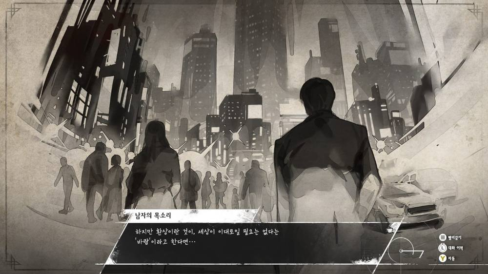
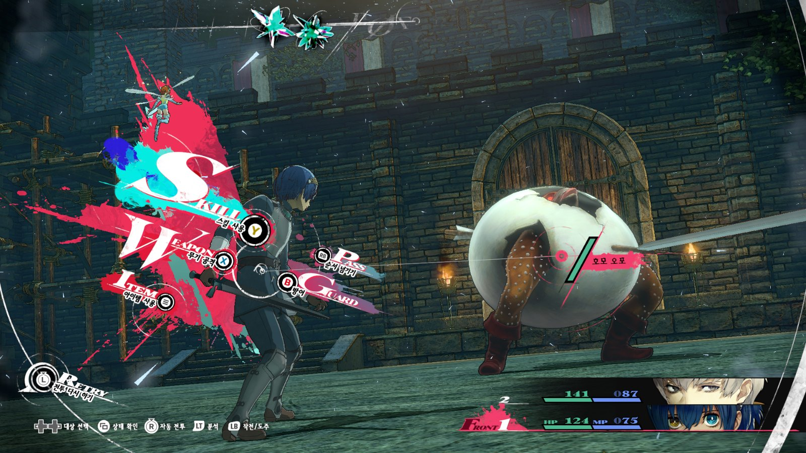
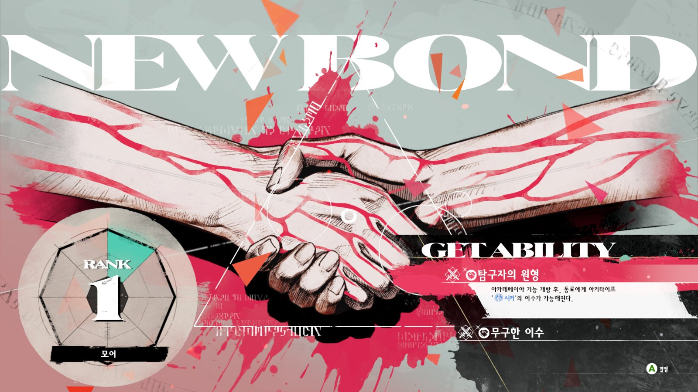

안녕하세요, 오늘은 아틀러스의 판타지 RPG 작품인 메타포: 리판타지오에 대해 간략하게 리뷰를 남겨보려 합니다.

본편 내용에 대한 구체적인 언급은 최소화하고, 대략적인 게임 로직이나 개발사의 주요 RPG 작품인 페르소나와의 소소한 차이점 등을 위주로 소개할 예정입니다.

## 타이틀 정보

- 타이틀 - 메타포: 리판타지오
- 장르 - RPG
- 이용등급 - 15세이용가
- 플레이 인원 - 1인
- 플랫폼 - Xbox Series X|S / Windows /PlayStation®5 / PlayStation®4 / Steam / Nintendo Switch 2(예정)
- 지원 음성：일본어 / 영어
- 지원 자막：한국어 / 일본어 / 영어 / 중국어 간체자 / 중국어 번체자 / 프랑스어 / 이탈리아어 / 독일어 / 스페인 / 브라질 포르투갈어 / 러시아어

## 스토리

> 유크로니아 연합 왕국의 왕이 누군가에게 암살당하고 나라가 혼란하다.
> 왕자 역시 이전에 암살당해 왕위는 빈 자리.
> 왕위를 누가 이을지를 두고 의견이 분분한 가운데, 하늘에 왕의 모습을 한 얼굴바위가 떠오르더니 하는 말,
> "
> 국민의 신임을 가장 많이 얻은 자가 왕이 될 것이다.
> "
> 갑자기 국민투표를 통한 차기 왕 선출을 선언하고, 국교인 신성교 장로 포든과 힘에 의한 평등을 주장하는 루이 등 다양한 후보들이 왕권을 놓고 겨루게 되는데…
> 주인공은 요정 갈리카와 함께, 세간에는 암살로 죽은 것으로 알려진 왕자에게 걸린 저주를 풀기 위해 왕국으로 향하게 된다.

## 세계관

게임의 독특한 세계관과 설정이 자연스레 게임 플레이에 녹아 있습니다.
가장 대표적으로... 모험의 무대가 되는 유크로니아 연합 왕국은 8개의 종족이 함께 살아가는데, 종족마다 사회적으로 받는 평가나 취급이 매우 다르고 작중에서도 이런 사회 분위기가 꾸준히 언급됩니다. 때문에 주인공이 여정 속에서 만나는 인물들은, 각자의 종족적인 맥락에 따라 각기 다른 시련을 겪게 됩니다.

이뿐만 아니라 왕국 전역에서 사용되고 있는 마도기의 에너지원, 주인공이 가지고 다니는 환상 소설이 쓰인 책 등, 게임의 요소나 주제 의식이 반복적으로 변주되어 나타나게 되어 스토리를 진행할 수록 퍼즐이 맞아들어가는 느낌을 받게 됩니다.

## 전투

### 아키타이프를 통한 개성있는 전투

주인공과 파티원은 기본적으로 장착하고 있는 무기 외에도 아키타이프라는 능력을 하나씩 갖추고 전투를 진행합니다.
아키타이프는 각자 특화된 분야와 공격 속성 등 각자의 개성을 가지고 있기 때문에, 그 자체로 다양한 플레이와 전략을 고민해볼 수 있게 합니다.

### 색다른 프레스 턴 시스템

차례를 넘기거나, 적의 약점을 찌르거나 하면 프레스가 반만 감소해 프레스 1개분으로 사용할 수 있습니다. 이 점을 활용해 프레스를 많이 사용하는 기술을 쓸 때 반턴짜리 프레스를 사용한다거나, 파티를 한바퀴 돌려 적에 턴이 오기 전에 약점을 공격할 수 있는 파티원에게 공격 기회를 한번 더 넘겨준다거나 하는 전략적인 플레이가 가능합니다.

또한 게임 안에서 악천후라는 날씨 요소가 영향을 주기도 하는데, 이 경우 아군이 적의 약점을 공격해도 프레스가 하나 감소하여 던전 공략에 어려움을 줍니다. 보상이 증가한다고는 하지만 크게 체감되지 않고, 던전 이동까지 수 일을 소모하는 경우가 많은 본작의 맵 디자인 상 날씨에 따른 불편함이 컸습니다.

### 다양한 편의성 기능

맵에서 레벨이 낮은 적의 경우 배틀 인카운트에 돌입하지 않고 처치가 가능하도록 구성하여, 던전 진행에 걸리는 요소가 적고 편리했습니다.

또한 전투 안에서 전투 다시 하기 기능을 제공하기 때문에, 키 입력 실수나 역전이 어려운 상황에 놓였을 때 빠르고 부담없이 재도전 할 수 있다는 점이 좋았습니다.

단 너무 남용할 경우, 강력한 적과의 배틀에 대한 무게감이 줄어들 수 있습니다.
예를 들면, 불리한 상황에 놓였을 때 첫 턴에 도망을 성공할 때 까지 다시 하기를 누르고, 도망에 성공한 경우 찬스 인카운터로 선공을 다시 잡고 전투에 돌입하는게 가능하거든요.

## 캘린더 시스템

본작 역시 페르소나가 그랬듯이 캘린더 시스템을 사용하고 있습니다.
하루에 어떤 행동을 하면 시간이 지나고, 때문에 하루에 할 수 있는 행동이 제한되어 있습니다.

### 인간 스테이터스

게임 안의 스테이터스 말고도, 담력, 견식, 포용력, 설득력, 상상력이라는, 미덕에 관련된 스테이터스가 존재합니다. 다양한 활동을 통해서 스테이터스를 성장시킬 수 있고, 스테이터스가 높을수록 대화나 행동에서 선택할 수 있는 행동이 다양해집니다.

### 인연

다른 인물들과 협력 관계에 놓여 게임 플레이에 도움이 되는 효과를 얻을 수 있습니다.

본작의 경우 유사한 시스템을 차용한 이전 게임들과 달리 선택지에 따라 상대의 호감도가 다르게 올라가는 부분을 확정적인 호감도 상승과 추가 재화 획득으로 재편하여 난이도가 완화되었으며, 스케줄도 넉넉하게 마련되어 모든 인물과의 최고 인연 달성이 매우 쉬워졌습니다.

그러나 오히려 후반부에 들어서 이미 모든 인연 이벤트를 마무리하고 스케줄이 너무 텅 빈 나머지 허전하다는 느낌을 받기도 했습니다.

## 요약

### 좋았던 점

- 개성있는 턴제 전투(아키타이프, 프레스 턴)
- 다양한 편의성 기능(빠른 처치, 전투 다시 시작하기)
- 여유있는 던전 공략 스케줄과 인연 스탯 달성 난이도 완화

### 아쉬웠던 점

- 다소 난잡한 일부 아키타이프 족보
- 불합리하게 느껴지는 악천후 효과
- 널널한 스케줄 때문에 유저에 따라 다소 비어보일 수 있는 후반부

## 마치며

게임사의 대표작인 페르소나 시리즈를 플레이해보신 분이라면, 게임 플레이와 스토리 면에서 어딘가 익숙하면서도 색다른 맛을 느끼실 수 있을 겁니다.
스토리에 대해서 정말 마음에 드는 부분이 많은 게임이라, 스포일러 없이는 기본적인 부분밖에 전달드릴 수 없다는 점이 아쉽네요...

기회가 된다면 게임의 스토리에 대한 생각을 담은 기록을 하나 더 남기도록 하겠습니다.
