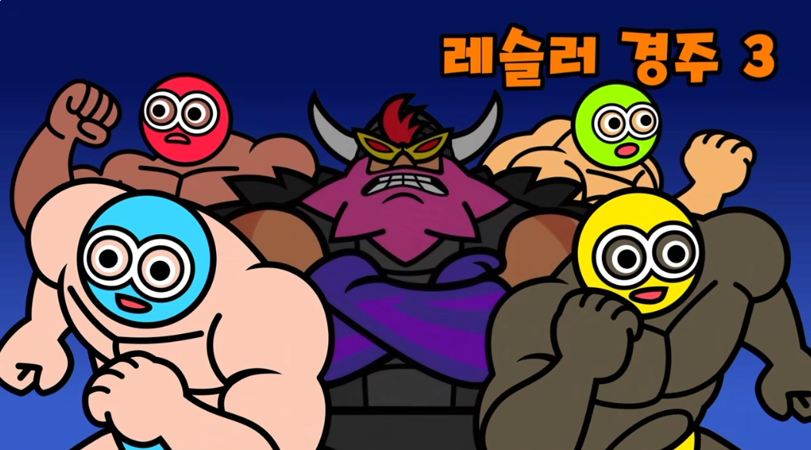

이번에 학창 시절 친구들과 오랜만에 만나게 되어, 함께 멀티 플레이 게임들을 플레이해보았습니다.

**결론부터 말하자면 본편 그 이상의 재미였습니다.**

많은 게임을 즐겼지만, 특히나 재밌게 플레이한 게임은 바로...

## 레슬러 경주 시리즈

**레슬러 경주 시리즈입니다.**
레슬러지만 레슬링은 안 하고 경주를 하는 게임인데, 정박 리듬에 맞춰서 달릴 수 있고 정확한 타이밍에 버튼을 누를 수록 더 빠르게 달릴 수 있습니다.
멀티플레이 게임들이 공유하는 3단계의 난이도를 이 게임 역시 공유하고 있습니다.

난이도별 패턴(직접 플레이하시며 알아가는게 더욱 즐겁습니다)

||1. 정박 기본 달리기, 탱탱볼 패턴 (2박, 4박)||
||2. 1단계 기믹 + 악역 레슬러의 레이저 패턴 추가||
||3. 2단계 기믹 + 번개 기믹 추가(3번 경고, 길이 상이)||

전 특히 2단계에서 깜짝 기믹으로 나오는 ||2인3각||이 정말 황당하고 웃겼습니다 ㅋㅋㅋ

아래는 저희가 3단계를 플레이하며 너무 재밌게 웃었던 순간의 영상입니다.

https://youtu.be/DvPvizgNfjY

이렇게나... 굴렀는데도 어떻게든 1등을 지켜낸 보스씨의 모습이 인상적이지 않나요?

아쉽게도 스크린샷을 많이 찍지는 못했지만, 리듬천국 멀티 플레이 게임들이 전체적으로 게임의 밸런스가 좋고 경쟁과 협력 게임 등 그 종류가 다양해서 여럿이 오랜 시간동안 재밌게 즐길 수 있었습니다.

여러분도 기회가 된다면 가족이나, 친구들과 함께 플레이해 보세요!
